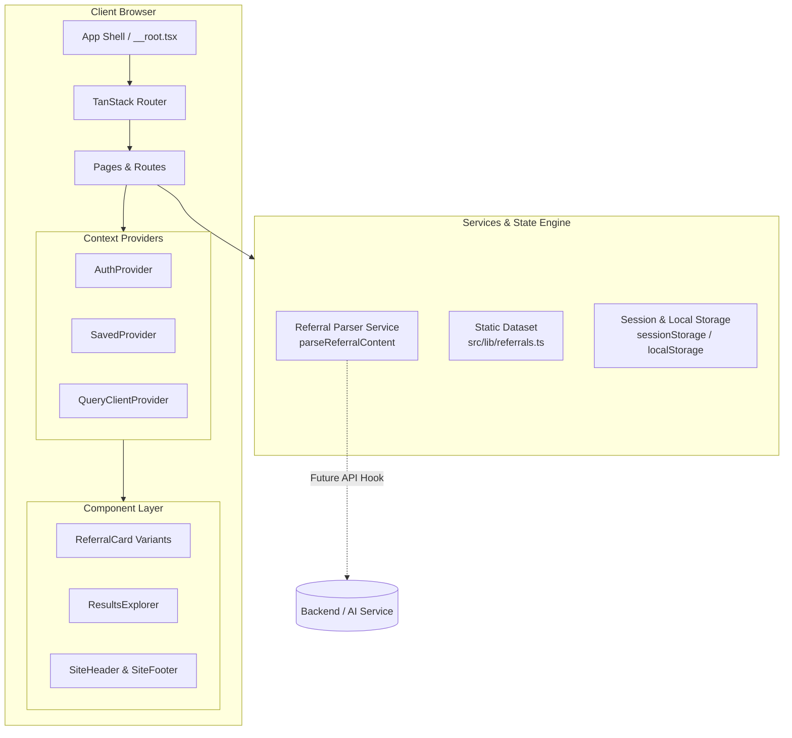

# Refova

> A curated, community-driven platform for discovering, sharing, and organizing referral links and promo codes.

---

## Overview

**Refova** is a modern web application designed to eliminate the friction of finding and sharing verified referral benefits. Instead of scouring scattered forums, chat groups, and outdated promo sites, Refova provides an editorial card-based marketplace where users can discover authentic referral benefits, verify terms, copy codes with one click, and share their own referral links effortlessly.

The platform embraces a **"Paste once. We organize everything."** philosophy. Rather than forcing contributors through cumbersome multi-field forms, Refova uses an intelligent ingestion parser that extracts brands, referral codes, discount amounts, conditions, and expiry dates directly from unstructured text.

---

## Key Features

- **Intelligent Referral Ingestion (3-Step Flow)**: Contributors paste free-form referral messages or links. The extraction engine automatically parses the brand, category, code, reward value, conditions, and expiration, rendering a live card preview that can be edited before publishing.
- **Dynamic Referral Discovery & Filtering**: Search across companies, services, and benefit tags. Multi-facet filtering by category (Finance, Shopping, Food, Travel, etc.), reward type (Cashback, Discount, Free Month, Credits), and sorting (Popular, Newest, Verified).
- **Asymmetrical Card Design System**: Multi-variant card components (`Featured`, `Standard`, `Compact`, and `List` views) with custom typography, benefit badges, trust scores, and visual claim conditions.
- **One-Click Claim & Bookmark Engine**: Instant clipboard copy with animated visual feedback and local persistence for bookmarked referrals.
- **Client-Side Authentication & Profiles**: Complete user authentication lifecycle (`/login` and `/signup`) with real-time field validation, `sessionStorage` persistence, automatic profile navigation, and auth-guarded routing.
- **User Dashboard & Community Profiles**: Public profile view displaying contributor trust scores, bio, active postings, past shares, and saved referrals.
- **Editorial Design & Micro-Interactions**: Warm cream canvas, expressive typography, responsive layouts, card hover-lift effects, and spring-based animated interactions.

---

## Tech Stack

| Layer                     | Technology                                                                                    | Description                                                              |
| :------------------------ | :-------------------------------------------------------------------------------------------- | :----------------------------------------------------------------------- |
| **Frontend Framework**    | [React 19](https://react.dev/)                                                                | Component architecture with modern hooks and React 19 compiler readiness |
| **Routing & App Shell**   | [TanStack Router](https://tanstack.com/router) & [TanStack Start](https://tanstack.com/start) | Type-safe, file-based routing and SSR application shell                  |
| **State & Data Fetching** | [TanStack Query v5](https://tanstack.com/query)                                               | Async state handling, query caching, and client contexts                 |
| **Styling & Theme**       | [Tailwind CSS v4](https://tailwindcss.com/)                                                   | CSS-first styling engine utilizing custom OKLCH color tokens             |
| **UI Components & Icons** | [Radix UI](https://www.radix-ui.com/) & [Lucide React](https://lucide.dev/)                   | Accessible UI primitives and iconography                                 |
| **Notifications**         | [Sonner](https://sonner.emilkowal.ski/)                                                       | Toast notification system for user actions and feedback                  |
| **Validation**            | [Zod](https://zod.dev/)                                                                       | Schema validation for query parameters and forms                         |
| **Build & Tooling**       | [Vite 8](https://vitejs.dev/) & [TypeScript 5.8](https://www.typescriptlang.org/)             | Next-generation frontend tooling and strict static typing                |

---

## Application Architecture

Refova is built with a modular, decoupled architecture where presentation, client-side state, and extraction services are strictly isolated.



---

## Project Structure

```text
refova/
├── public/                     # Static assets and open-graph preview images
│   ├── og/                     # Dynamic OG preview cards (home, discover, post, referral)
│   ├── favicon.ico
│   └── robots.txt
├── src/
│   ├── components/
│   │   ├── referral/           # Referral cards, action buttons, badges, results explorer
│   │   ├── site/               # Header, footer, animated reveal wrappers, brand wordmark
│   │   └── ui/                 # Reusable Radix-based UI components (dialogs, dropdowns, inputs)
│   ├── hooks/                  # Custom React hooks (use-mobile, etc.)
│   ├── lib/
│   │   ├── auth.tsx            # Auth context, session state, login/signup/logout methods
│   │   ├── referral-parser.ts  # NLP & rule-based referral extraction service
│   │   ├── referrals.ts        # Referral types, categories, and mock community dataset
│   │   ├── saved.tsx           # Saved/bookmarked referrals context & storage adapter
│   │   └── utils.ts            # Classnames merging (clsx + tailwind-merge)
│   ├── routes/                 # File-based TanStack routes
│   │   ├── __root.tsx          # Root shell layout with global providers and SEO head tags
│   │   ├── index.tsx           # Home landing page with hero, featured cards, and category grid
│   │   ├── discover.tsx        # Search and discover feed with dynamic filters
│   │   ├── category.$slug.tsx  # Category-specific referral listings
│   │   ├── referral.$id.tsx    # Single referral detail page with claim instructions
│   │   ├── post.tsx            # 3-step simplified referral creation flow
│   │   ├── profile.$username.tsx # User profile and referral management dashboard
│   │   ├── login.tsx           # Authentication login page
│   │   └── signup.tsx          # User registration page
│   ├── routeTree.gen.ts        # Auto-generated TanStack route tree
│   ├── server.ts               # SSR entry point and catastrophic error handler
│   ├── start.ts                # TanStack Start middleware (CSRF and error handling)
│   └── styles.css              # Tailwind v4 CSS theme, typography, and OKLCH color variables
├── package.json
├── tsconfig.json
├── vite.config.ts
└── README.md
```

---

## Getting Started

### Prerequisites

Ensure you have the following installed on your machine:

- **Node.js**: `v18.0.0` or higher
- **npm**: `v9.0.0` or higher

### Installation

1. Clone the repository:

   ```bash
   git clone https://github.com/aditya-yadav1176/refova.git
   cd refova
   ```

2. Install dependencies:
   ```bash
   npm install
   ```

### Running Locally

Start the local Vite development server:

```bash
npm run dev
```

The application will be accessible at:

```text
http://localhost:8080/
```

### Environment Variables

The current frontend prototype runs entirely client-side with mock data and local persistence. No external API keys are required for local development.

When connecting to external authentication or production backend services, configuration variables can be added to a `.env.local` file:

```env
# Optional future backend configuration
VITE_API_BASE_URL=https://api.yourdomain.com
```

---

## Core User Flows

### 1. Discovery & Claiming

```text
[Landing / Home]
       │
       ▼
[Discover Feed] ──(Search / Filter)──► [Select Referral Card]
                                              │
                                              ▼
                                    [Referral Detail Page]
                                              │
                                     [Copy Code / Save]
```

### 2. Simplified Ingestion Flow

```text
[Click 'Post a Referral']
       │
       ▼
[Step 1: Paste Textarea] ──(Enter message/code)──► [Click 'Create Referral']
                                                         │
                                                         ▼
[Step 2: Review & Edit]  ◄──(Live Preview Card)─── [Parser Extracts Parameters]
       │
       ▼
[Step 3: Publish] ──► [Live Referral in Feed]
```

---

## Authentication System

Authentication is managed via a centralized React Context Provider ([`src/lib/auth.tsx`](file:///d:/Projects/refova/src/lib/auth.tsx)) designed with isolated swap-points for backend authentication providers:

- **State Management**: Persists the authenticated user in `sessionStorage` under `refova-auth-user`.
- **Validation**: Client-side field validation for email formats, password strength (min. 8 characters), and password confirmation matching.
- **Route Guards**: Authenticated users attempting to visit `/login` or `/signup` are automatically redirected to their profile dashboard or intended destination.
- **Backend Readiness**: The authentication functions (`mockAuthLogin` and `mockAuthSignup`) are fully decoupled, allowing drop-in integration with services such as Firebase Auth, Supabase, or custom OAuth/JWT endpoints.

---

## Referral Parser Architecture

The extraction logic in [`src/lib/referral-parser.ts`](file:///d:/Projects/refova/src/lib/referral-parser.ts) exposes a single asynchronous interface:

```typescript
export async function parseReferralContent(raw: string): Promise<ParsedReferral>;
```

### Supported Extraction Capabilities

- **Brand Detection**: Pattern-matches brand identities across e-commerce, fintech, food delivery, travel, streaming, and developer tools.
- **Code & Link Parsing**: Identifies promo codes, token sequences, and affiliate URLs.
- **Benefit Extraction**: Detects cashbacks (e.g., `₹500 CASHBACK`), percentage discounts (`20% OFF`), free trials (`1 MONTH FREE`), and credit rewards.
- **Condition Parsing**: Identifies terms such as minimum spend thresholds, KYC requirements, and new-user constraints.
- **Expiration Dates**: Normalizes natural language date formats into structured strings.

> **Backend Developer Note**: To connect a server-side AI model or regex microservice, simply replace the internal body of `parseReferralContent` with an HTTP `fetch` call to your API endpoint without altering the UI contracts.

---

## Available Scripts

| Command             | Purpose                                                              |
| :------------------ | :------------------------------------------------------------------- |
| `npm run dev`       | Starts the Vite development server with Hot Module Replacement (HMR) |
| `npm run build`     | Compiles the production build for client and server bundles          |
| `npm run build:dev` | Compiles a development-mode production build for inspection          |
| `npm run preview`   | Runs a local server to preview the production build                  |
| `npm run lint`      | Runs ESLint across the codebase                                      |
| `npm run format`    | Formats all code files using Prettier                                |

---

## Design & UI System

- **Color System**: Uses OKLCH-based theme tokens (`--color-primary`, `--color-cream`, `--color-paper`, `--color-leaf`, `--color-grape`, `--color-rose`).
- **Typography Hierarchy**:
  - **Headings & Badges**: `Bricolage Grotesque`
  - **Body & UI**: `Plus Jakarta Sans`
  - **Referral Codes & Monospace Data**: `JetBrains Mono`
- **Responsive Layout**: Designed mobile-first with adaptive layouts for standard mobile viewports, tablets, and wide-screen desktop displays.

---

## Security & Reliability

- **CSRF Protection**: Pre-configured CSRF middleware integration via TanStack Start in `src/start.ts`.
- **SSR Error Normalization**: Fallback SSR error wrapper in `src/server.ts` to prevent server crashes from unhandled execution exceptions.
- **Client Input Sanitization**: Controlled form inputs and boundary error logging.

---

## Contributing

Contributions, issues, and feature suggestions are welcome.

1. Fork the repository
2. Create your feature branch (`git checkout -b feature/amazing-feature`)
3. Commit your changes (`git commit -m 'Add some amazing feature'`)
4. Push to the branch (`git push origin feature/amazing-feature`)
5. Open a Pull Request
